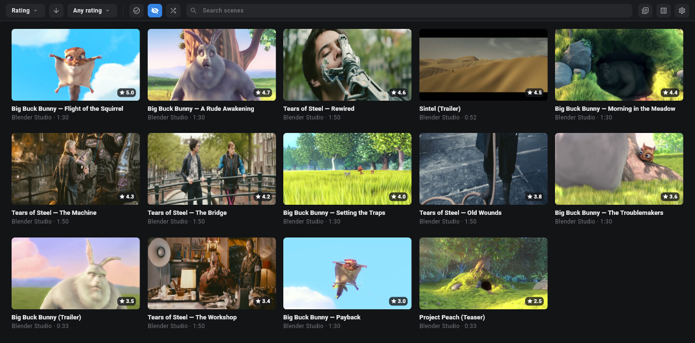
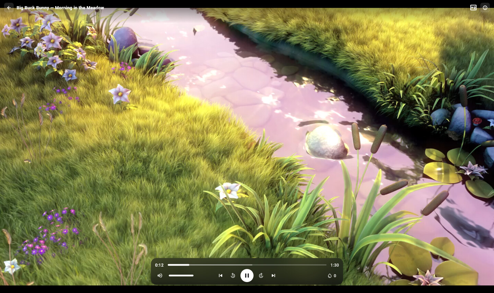
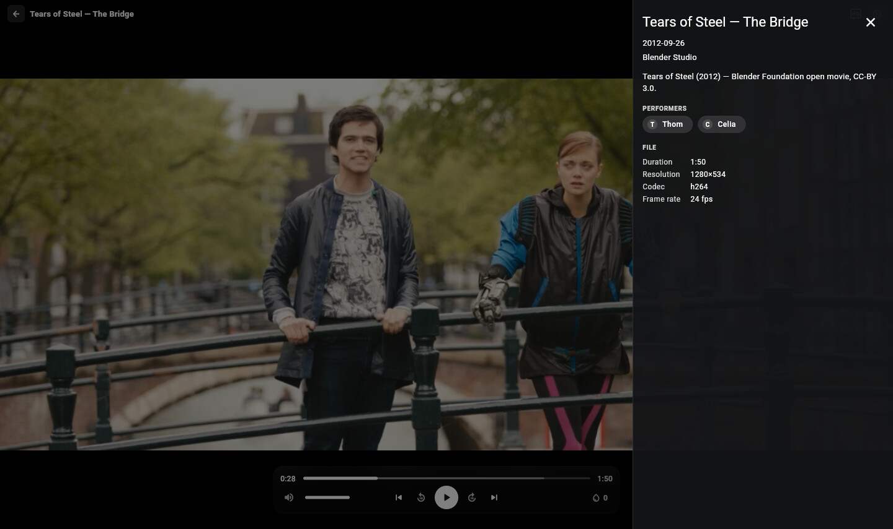

# Stash Player

A desktop player for your [Stash](https://github.com/stashapp/stash) library,
for Linux and macOS. Browse your scenes, pick one, and it plays right away
in a native window with hardware-accelerated video, not in a browser tab.
Your watch progress, play counts and ratings sync back to Stash as you go.







## What it does

- **Browse your library.** Search, sort by date, title, rating, play count,
  duration and more, filter by minimum rating or organized status, or hit
  **Play random**.
- **Show only what you haven't watched.** The "hide played" filter is on by
  default, so the grid opens on scenes you haven't watched yet. Turn it off
  to see everything.
- **The video comes first.** The scene page is all video. Performers,
  studio, description and file details sit in a drawer you can open over
  the video, so it never gets resized.
- **Pick up where you left off.** Resume position and play counts are saved
  back to Stash automatically, so they carry over to the Stash web UI and
  your other devices.
- **Stay in the player.** Previous/next scene (following your current sort
  and filters), the star rating and the O-counter are all in the on-screen
  controls.
- **Playback that just works.** Direct play first, and if the file won't
  play it falls back to Stash's HLS or MP4 transcodes. You can also pick a
  stream yourself from the quality menu.
- **Scan for new files.** Start a library scan from the toolbar and watch
  Stash's background tasks without opening the web UI.
- **Remote servers.** Your API key is kept in the system keyring, and an
  optional SOCKS5 proxy handles servers you can only reach through a
  tailnet or SSH tunnel.

## Install

### Linux (Flatpak)

Download `stash-player.flatpak` from the [latest
release](https://github.com/arsfeld/stash-player/releases/latest) and install
it:

```sh
curl -L -o stash-player.flatpak \
  https://github.com/arsfeld/stash-player/releases/latest/download/stash-player.flatpak

flatpak install --user stash-player.flatpak
flatpak run dev.arsfeld.stash-player
```

The GNOME runtime comes from Flathub, which most desktops already have set
up. If yours doesn't:

```sh
flatpak remote-add --if-not-exists --user flathub https://flathub.org/repo/flathub.flatpakrepo
```

To update, download the new bundle and run `flatpak install` again.

### macOS (Apple Silicon, macOS 14+)

Download `StashPlayer-macos-arm64.zip` from the [latest
release](https://github.com/arsfeld/stash-player/releases/latest), unzip it,
and drag **StashPlayer.app** into Applications. Or from a terminal:

```sh
curl -L -o StashPlayer-macos-arm64.zip \
  https://github.com/arsfeld/stash-player/releases/latest/download/StashPlayer-macos-arm64.zip

unzip StashPlayer-macos-arm64.zip -d /Applications
open /Applications/StashPlayer.app
```

The app is signed and notarized, so it opens without a Gatekeeper warning.
It updates itself: use **Stash Player → Check for Updates…**.

## Getting started

The first time you open the app, it asks for your Stash server:

- **Stash server URL**: the address you use for Stash in a browser, e.g.
  `http://192.168.1.10:9999` or `https://stash.example.com`.
- **Stash API key** (optional): only needed if your Stash has a username
  and password set. Copy it from Stash's *Settings → Security → API Key*.
- **SOCKS5 proxy** (optional): `host:port`, if your server is only
  reachable through a proxy.

Click **Test connection**. Once it connects, your library opens, and next
time the app goes straight there. To change servers later, use the gear
icon in the library toolbar.

**Upgrading from an older Stash Player?** Your saved server, API key and
proxy are imported automatically on first launch, so you skip this step.

## Keyboard shortcuts

In the player:

| Key | Action |
| --- | --- |
| `Space` / `K` | Play / pause |
| `←` / `→` | Back / forward 5 seconds |
| `J` / `L` | Back / forward 10 seconds |
| `↓` / `↑` | Back / forward 1 minute |
| `Home` / `End` | Jump to start / end |
| `9` / `0` | Volume down / up |
| `M` | Mute |

## Known limitations

- **No fullscreen yet.** The `F` key and the fullscreen button don't do
  anything for now. Maximize the window instead.
- **macOS builds are Apple Silicon only.** There's no Intel build.
- **No Windows support.** CI compiles a Windows build, but nobody tests it
  and it isn't released.

## A note on the older versions

Stash Player started out as two separate native apps: a Rust + GTK4/libadwaita
client for Linux and a SwiftUI client for macOS. Keeping two codebases
feature-matched on two platforms was too much work, so from 1.0 there is one
Flutter app for both. It installs over the old apps (same app ID and update
channel) and brings your connection settings with it.

The old code is still in the repo (`crates/` and `apps/macos/`), frozen: no
new features and no new releases.

## Building from source

The app lives in [`apps/flutter/`](apps/flutter/). With Nix:

```sh
nix develop .#flutter
just flutter-run      # build and launch
just flutter-check    # format, analyze and test (what CI runs)
nix run .#flatpak     # build and install the Flatpak locally
```

[`apps/flutter/README.md`](apps/flutter/README.md) covers setup, testing,
troubleshooting and releasing. For a local Stash to develop against, see
[`tools/dev-stash/`](tools/dev-stash/README.md), a real Stash in Docker or
devenv with sample clips. For UI work without video playback, see
[`tools/mock-stash/`](tools/mock-stash/README.md), a small offline stand-in
server.

## Credits

The screenshots show clips from the Blender Foundation's open movies [*Big Buck
Bunny*](https://peach.blender.org/), [*Sintel*](https://durian.blender.org/)
and [*Tears of Steel*](https://mango.blender.org/). © Blender Foundation,
[CC-BY 3.0](https://creativecommons.org/licenses/by/3.0/).

## License

MIT, see [LICENSE](LICENSE).
