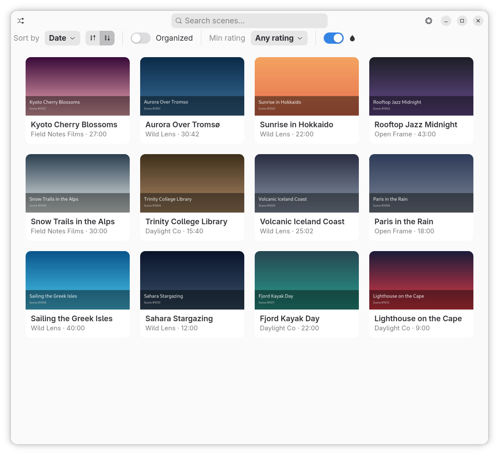

# Stash Player

Cross-platform native desktop client for [Stash](https://github.com/stashapp/stash):
browse your library and play scenes locally with hardware-accelerated video,
with watch progress and play counts synced back to Stash.

- **Linux** — GTK4 + libadwaita, relm4, GStreamer (`stash-player-ui`).
- **macOS** — SwiftUI + AVKit on top of the same Rust networking layer via
  UniFFI (`apps/macos/`).

Both frontends share the `stash-api` GraphQL client and `stash-player-core`
config/secret/cache crates, so feature work lands once and shows up on both
platforms.



## Features

- Browse your library with search, sort (title / date / rating / random / …),
  rating filter, organized filter, and a "hide tracked" switch that defaults to
  untracked-only so the grid opens to fresh material.
- "Play random" shortcut from the toolbar.
- Inline scene player with mpv-style keyboard shortcuts and hardware-accelerated
  playback (VA-API on Linux, VideoToolbox on macOS).
- Scene detail pages with performers, metadata, prev/next navigation that
  honours the library's current filter, and an "Open in Stash" shortcut.
- Resume where you left off — watch progress and play counts sync back to Stash
  automatically (`sceneSaveActivity`), throttled and flushed on pause / seek /
  close.
- Per-scene "O counter" with increment + reset.
- API key stored in the system keyring (Secret Service on Linux, Keychain on
  macOS).
- macOS extras: PiP, media keys / AirPods controls, and the system Now Playing
  widget via `MPRemoteCommandCenter` + `MPNowPlayingInfoCenter`.

## Install

### Linux (Flatpak)

Grab the Flatpak bundle from the latest GitHub release and install it:

```sh
flatpak remote-add --if-not-exists --user flathub \
  https://flathub.org/repo/flathub.flatpakrepo

curl -L -o stash-player.flatpak \
  https://github.com/arsfeld/stash-player/releases/latest/download/stash-player.flatpak

flatpak install --user stash-player.flatpak
flatpak run dev.arsfeld.stash-player
```

The bundle ships the binary and assets only; the GNOME 50 runtime is pulled
from Flathub on first install, which is why the Flathub remote is required.
To upgrade later, repeat the `curl` + `flatpak install` step with the new
bundle.

### macOS (Apple Silicon)

Download the notarized `.app` from the latest release:

```sh
curl -L -o StashPlayer-macos-arm64.zip \
  https://github.com/arsfeld/stash-player/releases/latest/download/StashPlayer-macos-arm64.zip

unzip StashPlayer-macos-arm64.zip -d /Applications
open /Applications/StashPlayer.app
```

Requires macOS 14 (Sonoma) or later on Apple Silicon. Intel Macs aren't built
in CI yet — see [Build → macOS](#macos) below for a from-source build.

## Repository layout

```
stash-player/
├── Cargo.toml                  # workspace
├── crates/
│   ├── stash-api/              # GraphQL client (version, find_scenes,
│   │                           #   find_scene, save_scene_activity,
│   │                           #   increment_o, reset_o,
│   │                           #   authenticated_url, fetch_bytes)
│   ├── stash-player-core/      # config, secrets, cache paths
│   ├── stash-player-ui/        # relm4 components — the Linux binary
│   └── stash-player-ffi/       # UniFFI bridge for the macOS app
├── apps/
│   └── macos/                  # SwiftUI app (Xcode project + sources)
├── data/                       # .desktop, AppStream metainfo, icon
├── build-aux/                  # Flatpak manifest, macOS xcframework script
└── flake.nix                   # Nix dev shell
```

## Build

### Linux

#### With Nix (recommended on NixOS)

```sh
nix develop
cargo run -p stash-player-ui
```

The flake pins a stable Rust toolchain plus GTK4, libadwaita, the GStreamer
plugin set (including `gst-plugins-rs` for `gtk4paintablesink`), libsecret,
and the supporting system libraries.

#### Without Nix

System dependencies:

- `gtk4`, `libadwaita`
- `gstreamer1.0` and the `base`, `good`, `bad`, `ugly`, `libav` plugin sets
- `gst-plugin-gtk4` (a.k.a. `gtk4paintablesink`, from `gst-plugins-rs`)
- `libsecret` (for the API-key keyring)
- `pkg-config`, `openssl`

Then:

```sh
cargo run -p stash-player-ui
```

VA-API acceleration is picked up automatically when the matching GStreamer
plugins are installed.

#### Flatpak (build from source)

For a local Flatpak build (rather than the prebuilt bundle linked above):

```sh
# With the Nix flake — clean build + install in one step:
nix run .#flatpak
flatpak run dev.arsfeld.stash-player

# Or directly inside `nix develop` (or with flatpak-builder + appstreamcli on
# PATH):
flatpak-builder --user --install --force-clean --install-deps-from=flathub \
  --repo=build-aux/repo build-aux/build-dir build-aux/dev.arsfeld.stash-player.yml
```

### macOS

The macOS frontend is a SwiftUI app driven by the same Rust crates. UniFFI
generates a Swift binding to a small wrapper crate (`stash-player-ffi`),
which is statically linked into the app via an XCFramework. AVKit handles
playback; the Keychain stores the API key.

#### Prerequisites

- Xcode 16+ (for SwiftUI on macOS 14)
- `rustup target add aarch64-apple-darwin` (or `x86_64-apple-darwin` for
  Intel Macs — append it to `TARGETS` in the build script and add a
  `lipo -create` step)
- [`xcodegen`](https://github.com/yonaskolb/XcodeGen) to (re)generate the
  Xcode project from `apps/macos/project.yml`: `brew install xcodegen`

#### Build

The flake exposes a one-liner that does everything (rust → xcframework →
xcodeproj → xcodebuild → launch):

```sh
nix run .#macos
```

`nix run .#macos-build` does the same minus the launch (useful from CI or
when you just want to refresh `Generated/`). `nix develop` drops you into a
shell with the pinned Rust toolchain + `xcodegen` + `MACOSX_DEPLOYMENT_TARGET=14.0`.

If you'd rather drive Xcode by hand:

```sh
./build-aux/build-macos-xcframework.sh        # rust staticlib + swift bindings
( cd apps/macos && xcodegen generate )        # only when project.yml changes
open apps/macos/StashPlayer.xcodeproj
```

After Rust changes, re-run the script (or `nix run .#macos-build`).

## Configuration

On first launch, open **Stash server** and enter:

- **URL** — e.g. `https://stash.example.tld`
- **API key** — copy it from Stash's *Settings → Security → API Key*

Click **Test connection** to confirm. The URL persists to the platform's
config dir (`~/.config/stash-player/config.toml` on Linux,
`~/Library/Application Support/stash-player/` on macOS); the API key goes to
the system keyring.

## Keyboard shortcuts (player)

| Key | Action |
| --- | --- |
| `Space` / `k` | Play / pause |
| `←` / `→` | Seek ∓5s (hold `Shift` for ∓1s, Linux only) |
| `j` / `l` | Seek ∓10s |
| `↑` / `↓` | Seek ±60s |
| `Home` / `End` | Seek to start / end (Linux) |
| `9` / `0` | Volume ∓5% |
| `m` | Mute |
| `f` | Toggle fullscreen |
| `Esc` | Exit fullscreen |

Click the player surface to toggle play/pause; double-click for fullscreen.

## License

MIT — see [LICENSE](LICENSE).
